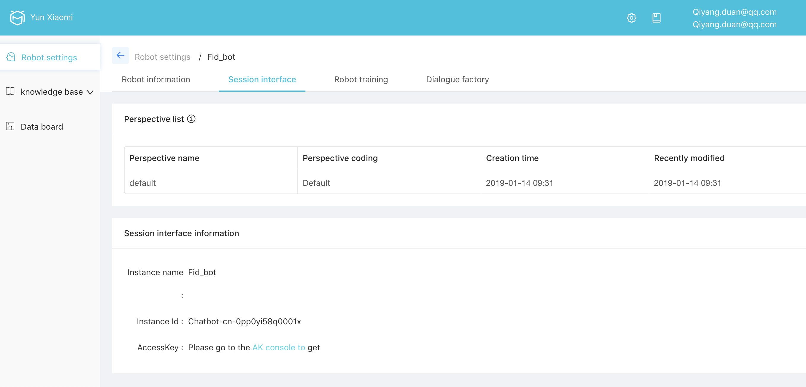

# Prerequisite

You need to setup your own cridentials and create one chatbot from GUI. As of now(Feb 2019), the alimebot is only available on China Site. This screenshot is taken after chrome translation.



Once you created a bot, come to the information page and fill in those information to the program:
* Instance Id
* api end point: 'https://chatbot.cn-shanghai.aliyuncs.com/?' . Change this one if not shanghai.

You should set those two OS Environment Variables before running example:
* ALIME_BOT_ACCESS_ID
* ALIME_BOT_ACCESS_KEY_SECRET

You can do so by: 
```sh
export ALIME_BOT_ACCESS_ID="LTAIIH1XwvRpAauD"
export ALIME_BOT_ACCESS_KEY_SECRET="PKS2ZXhWDwXrv1rJnDlbqVd8G9N6Yd"
```


# Ready to run

simply run chat.py with message, enclosed by inverted commas. If you get this one, the "Content" part is the answer from the bot.

```sh
qiyang@duanmac.local[~/Documents/qduan/work/git/alibaba_cloud_tutorial/alimebot_chat_api_example]$ python chat.py "transfer money to bank"
{"SessionId":"bb7bed8995ad4ba59ffa5f375f5e2b3b","Messages":[{"Text":{"Content":"which country do you want to transfer to?","AnswerSource":"BotFramework"},"Type":"Text","Knowledge":{}}],"MessageId":"cf6c3522f3b54aaea5ec260a915d242e","RequestId":"84310E7E-17F4-4E40-853B-EDE2AB1C08A0"}
```
