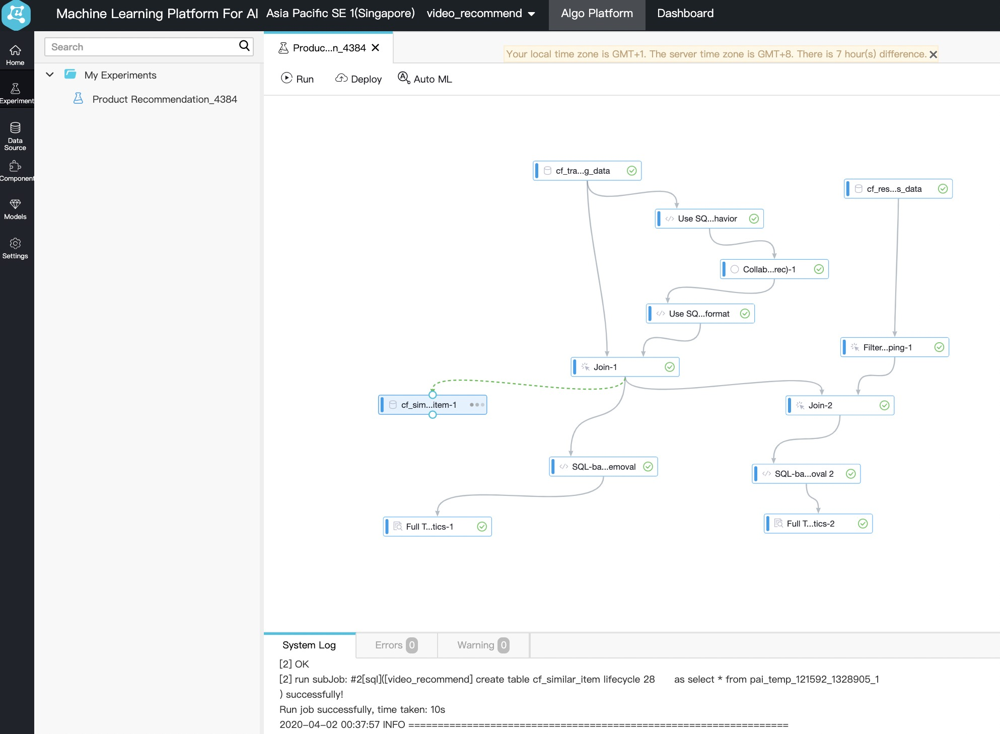

# Recommendation for Retail Shop, or Content (Video, Music, News etc)

## Business problem definition

Given some users and some items, and the history of each customer interacting each item, this solution should predict which user are likely to interact with which item.

## Solution Diagram


Basically, your sales website should be:
* pushing customer purchase/click logs onto Alibaba cloud OSS
* pulling the recommendation result from Maxcompute Data Service for rendering result.

I am following this [official guide](https://www.alibabacloud.com/help/doc-detail/67394.htm) on PAI platform and created this solution. 

Unfortunately, there is no data to reproduce the steps. So I downloaded from this [link on UCI](https://archive.ics.uci.edu/ml/datasets/Online+Retail#) a similar dataset for easier reproduction. You download the sample by yourself, or get it from this repository at [online_retail_200_rows.csv](./data/online_retail_200_rows.csv).  In same folder, there is the larger original one.


## List of cloud product used.
* [Maxcompute+dataworks] (https://www.alibabacloud.com/product/ide) -- This is an IDE for big data, which works on top of Hadoop (EMR), OSS, Database, etc.
* [PAI] (https://www.alibabacloud.com/product/machine-learning?spm=a2c63.p38356.1389108.dnavproductai3.6fba3679qCWqJ1) -- This is a collection of AI algorithms, with drag and drop design interface.
* [OSS] (https://www.alibabacloud.com/product/oss?spm=a3c0i.7911826.1389108.133.9fbf14b3D5kdU4) -- This is a file storage.

## Prerequisite
You need to setup your own cridentials for run the samples.

## Input Information
This solution requests 3 input information:
* User List
* Item List
* Interaction history


## Output Information

This solution produce a table with three columns:
* User_id
* Item_id
* Similar_item_id

The result means for each user_id, you can recommend those products from "similar_item_id".

## Steps
### 1. upload onto OSS
### 2. upload onto Load into Maxcompute storage

Follow the dataworks [guide](https://www.alibabacloud.com/help/doc-detail/84670.htm)

### 3. Use dataworks+maxcompute to transform the data into PAI input format.


This is one [sample SQL](./src/recommend.sql) to transform original transaction into PAI [Collaborative Filtering](https://www.alibabacloud.com/help/doc-detail/69688.htm?spm=a2c63.p38356.b99.13.34d13679JUwD0K#Collaborative%20filtering%20(etrec)) Format.

The SQL in dataworks look like 


```
git clone https://code.aliyun.com/best-practice/140.git 
```

### 4. Run PAI algorithm.
Create a project by PAI official tutorial. 
![recommendation_tutorial] (./doc/pai_tutorial_20200401182152.jpg).

The PAI project should look like:


### Wrap up all previous step into one business flow and run it every night.
Create a flow like this:

### (Optional) Serve your portal by data services

Please follow this [DataService studio](https://www.alibabacloud.com/help/doc-detail/73263.htm?spm=a2c63.l28256.b99.201.672f5b5aujXsy5) document to create data service API. Then in your portal, you can call this API to retrive information about a single user.


## Future Roadmap
If you want to setup more advanced recommendation, check out [this tutorial](https://www.aliyun.com/acts/best-practice/preview?&id=378791) as well. The sample data is hosted here:
```
git clone https://code.aliyun.com/best-practice/140.git 
```


## License

BSD Licensed.

## Reference and Acknowledge Information
I am using a dataset from UCI for online retail sales. If you know more good content recommendation dataset, let me know, and we will make more approperiate version for advance content.

You may find original dataset from this [link on UCI](https://archive.ics.uci.edu/ml/datasets/Online+Retail#). I acknowledge and thank to provider by this reference:
```
    Daqing Chen, Sai Liang Sain, and Kun Guo, Data mining for the online retail industry: A case study of RFM model-based customer segmentation using data mining, Journal of Database Marketing and Customer Strategy Management, Vol. 19, No. 3, pp. 197–208, 2012 (Published online before print: 27 August 2012. doi: 10.1057/dbm.2012.17).

```
